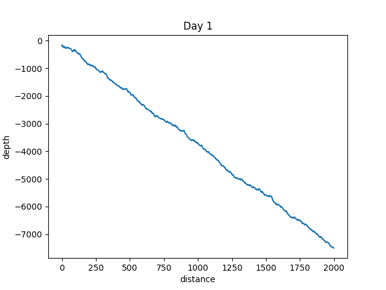
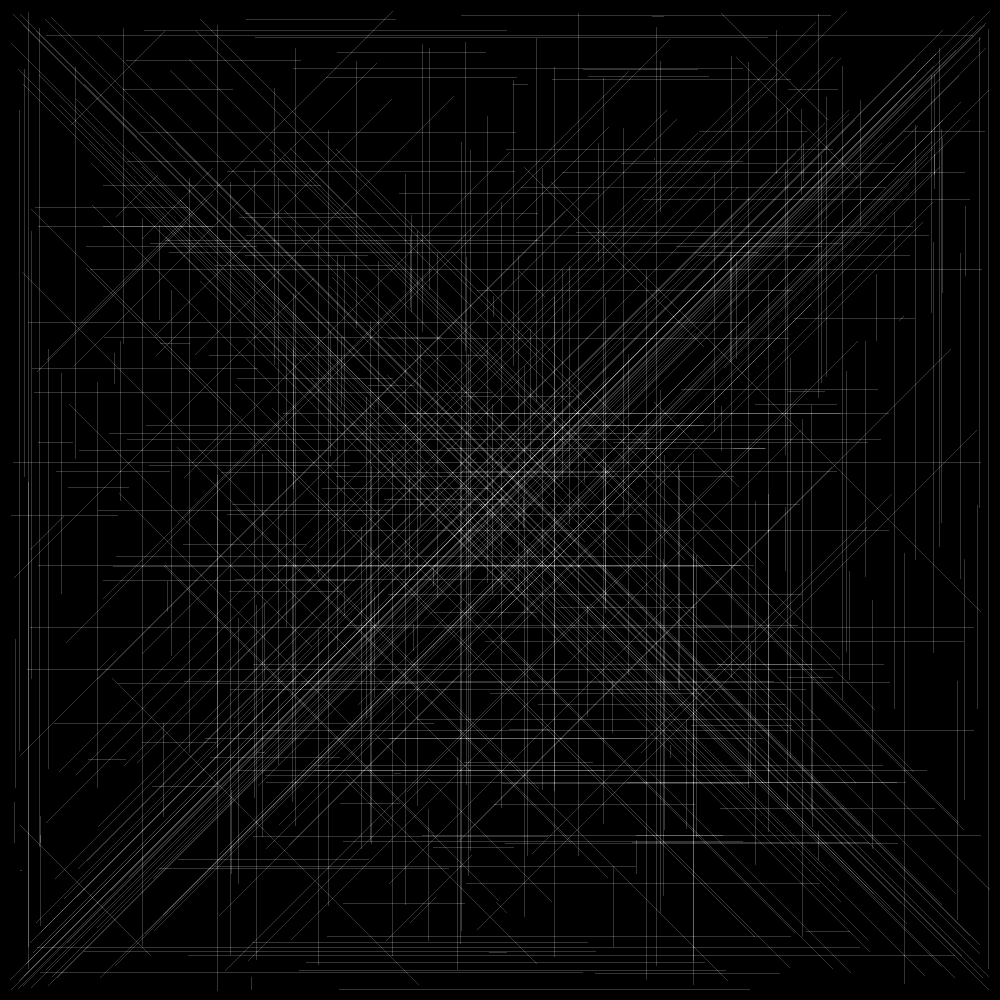
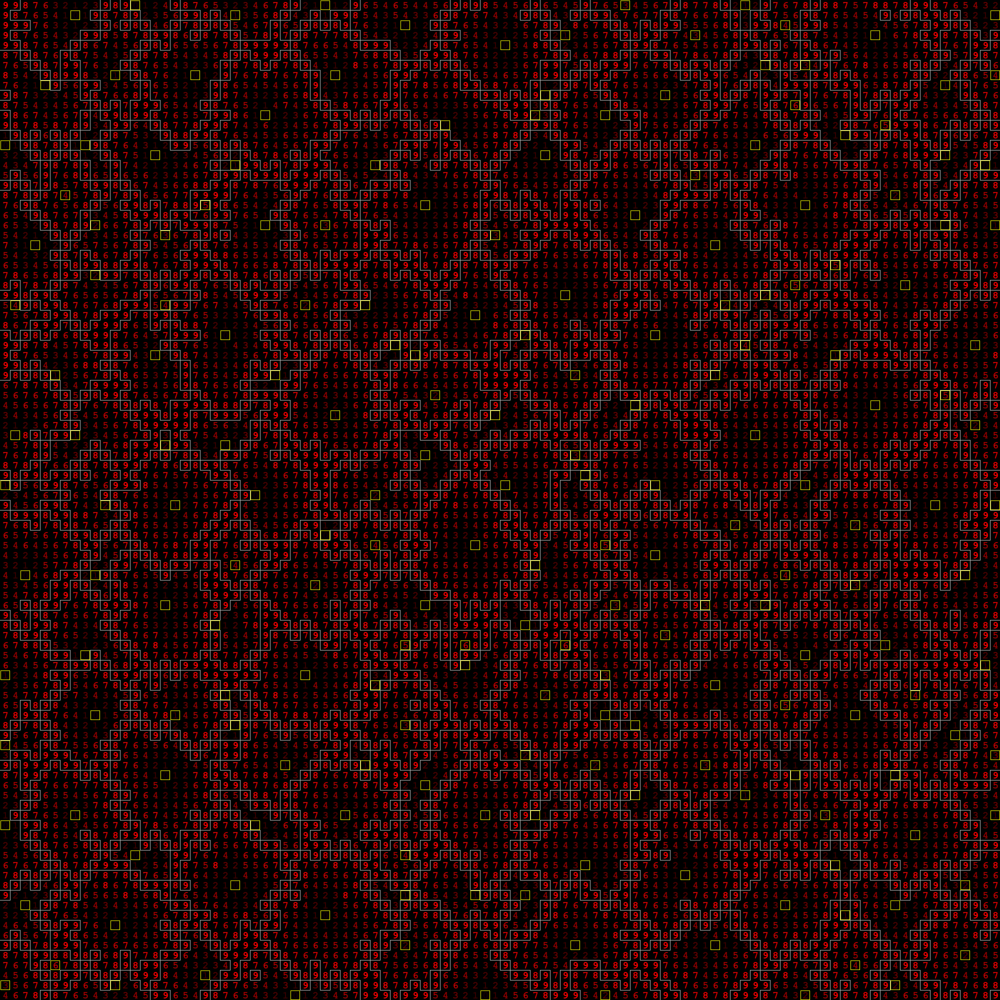

AoC 2021
========

Day 1: Depth vs. distance
-------------------------

Day 2: Depth vs. position
-------------------------

Day 5: Hydrothermal vents map
-----------------------------

Day 6: Exponential population growth
------------------------------------

Day 9: Hydrothermal vents smoke
-------------------------------

